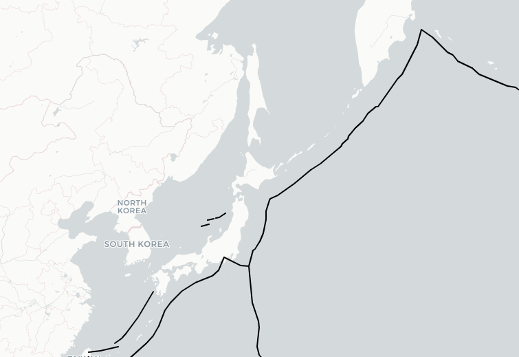
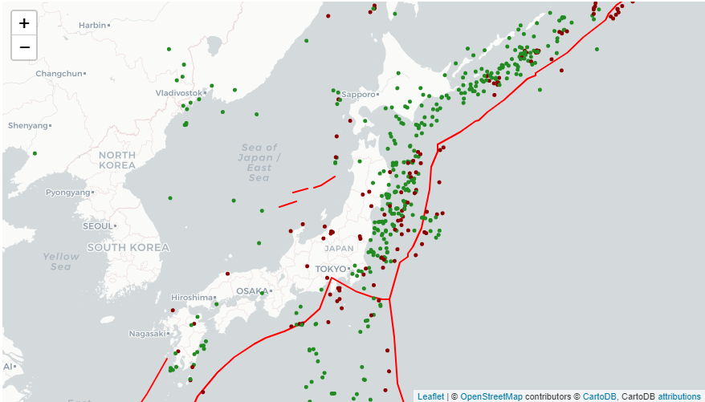

# Earthquake-Reinforcement-Analysis
Geospatial Analysis of Japan's Earthquake Reinforcement

# Introduction

This project is used as an urban safety planning template in order to analyze and locate areas of Japan that need extra earthquake reinforcement which are prone to earthquakes and have high population density.

 

# Earthquakes & Global Plate Boundaries
## Plate Boundaries Dataset
Table for showing top 10 items of the plane boundries dataset

| HAZ_PLATES 	| HAZ_PLAT_1                                        	| HAZ_PLAT_2 	| Shape_Leng 	| coordinates                                       	|
|------------	|---------------------------------------------------	|------------	|------------	|---------------------------------------------------	|
| TRENCH     	| SERAM TROUGH (ACTIVE)                             	| 6722       	| 5.843467   	| [(-5.444200361999947, 133.6808931800001), (-5.... 	|
| TRENCH     	| WETAR THRUST                                      	| 6722       	| 1.829013   	| [(-7.760600482999962, 125.47879802900002), (-7... 	|
| TRENCH     	| TRENCH WEST OF LUZON (MANILA TRENCH) NORTHERN ... 	| 6621       	| 6.743604   	| [(19.817899819000047, 120.09999798800004), (19... 	|
| TRENCH     	| BONIN TRENCH                                      	| 9821       	| 8.329381   	| [(26.175899215000072, 143.20620700100005), (26... 	|
| TRENCH     	| NEW GUINEA TRENCH                                 	| 8001       	| 11.998145  	| [(0.41880004000006466, 132.8273013480001), (0.... 	|
| TRENCH     	| MANOKWARI TROUGH, SOUTH OF NEW GUINEA TRENCH      	| 8001       	| 4.793769   	| [(0.011499698000022818, 131.3704988940001), (-... 	|
| TRENCH     	| MARIANA TRENCH                                    	| 6621       	| 1.311175   	| [(10.99269965800005, 138.9326936230001), (10.9... 	|
| TRENCH     	| MARIANA TRENCH                                    	| 6621       	| 1.411513   	| [(10.981199960000026, 140.2427066990001), (11.... 	|
| TRENCH     	| MARIANA TRENCH                                    	| 6621       	| 20.547210  	| [(11.08020016100005, 141.6506960370001), (11.2... 	|
| TRENCH     	| TRENCH, SOUTH OF SICILY                           	| 3401       	| 1.632744   	| [(37.47190102600007, 13.071900020000044), (37.... 	|

## Historical Earthquake
Table for showing top 10 items of the earthquake dataset
| DateTime                | Latitude | Longitude | Depth | Magnitude | MagType | NbStations | Gap | Distance | RMS | Source | EventID      |
|-------------------------|----------|-----------|-------|-----------|---------|------------|-----|----------|-----|--------|--------------|
| 1970-01-04 17:00:40.200 | 24.139   | 102.503   | 31.0  | 7.5       | Ms      | 90.0       | NaN | NaN      | 0.0 | NEI    | 1.970010e+09 |
| 1970-01-06 05:35:51.800 | -9.628   | 151.458   | 8.0   | 6.2       | Ms      | 85.0       | NaN | NaN      | 0.0 | NEI    | 1.970011e+09 |
| 1970-01-08 17:12:39.100 | -34.741  | 178.568   | 179.0 | 6.1       | Mb      | 59.0       | NaN | NaN      | 0.0 | NEI    | 1.970011e+09 |
| 1970-01-10 12:07:08.600 | 6.825    | 126.737   | 73.0  | 6.1       | Mb      | 91.0       | NaN | NaN      | 0.0 | NEI    | 1.970011e+09 |
| 1970-01-16 08:05:39.000 | 60.280   | -152.660  | 85.0  | 6.0       | ML      | 0.0        | NaN | NaN      | NaN | AK     | NaN          |
| 1970-01-20 07:19:51.200 | -25.800  | -177.349  | 80.0  | 6.5       | Mb      | 175.0      | NaN | NaN      | 0.0 | NEI    | 1.970012e+09 |
| 1970-01-20 17:33:05.400 | 42.519   | 142.966   | 46.0  | 6.4       | Ms      | 199.0      | NaN | NaN      | 0.0 | NEI    | 1.970012e+09 |
| 1970-01-21 17:51:38.500 | 7.017    | -104.298  | 33.0  | 6.6       | Ms      | 140.0      | NaN | NaN      | 0.0 | NEI    | 1.970012e+09 |
| 1970-01-26 10:01:20.500 | -12.579  | 166.370   | 50.0  | 6.4       | Ms      | 91.0       | NaN | NaN      | 0.0 | NEI    | 1.970013e+09 |
| 1970-02-04 05:08:48.000 | 15.532   | -99.484   | 21.0  | 6.5       | Ms      | 100.0      | NaN | NaN      | 0.0 | NEI    | 1.970020e+09 |

## Visualization: Plate Boundries in Japan

 

## Visualization : Earthquake Depth  & Plate Boundary Proximity Relationship in Japan
Red circle marker represent earthquake happening at 20 km depth, while green between 20 km and 800 km
Earthquake happening at 20 km depth is considered as [shallow earthquake](https://www.usgs.gov/faqs/what-depth-do-earthquakes-occur-what-significance-depth?qt-news_science_products=0#qt-news_science_products)

 

## Japan High Population  Density  Areas

| Urban Area 	| Population         	| Area(sq km)  	| Density     	|
|------------	|--------------------------	|--------------	|-------------	|
| Tokyo      	| 12868000                 	| 1800.614782  	| 7146.448049 	|
| Kanagawa   	| 8943000                  	| 2383.038975  	| 3752.771186 	|
| Osaka      	| 8801000                  	| 1923.151529  	| 4576.342460 	|
| Aichi      	| 7418000                  	| 5164.400005  	| 1436.372085 	|
| Saitama    	| 7130000                  	| 3794.036890  	| 1879.264806 	|
| Chiba      	| 6139000                  	| 5040.333626  	| 1217.974931 	|
| Hyogo      	| 5583000                  	| 8440.659814  	| 661.441182  	|
| Hokkaido   	| 5507000                  	| 78046.905779 	| 70.560132   	|
| Fukuoka    	| 5053000                  	| 5120.519956  	| 986.813848  	|
| Shizuoka   	| 3792000                  	| 8011.187549  	| 473.338063  	|
| Ibaraki    	| 2960000                  	| 6100.518339  	| 485.204672  	|
| Hiroshima  	| 2863000                  	| 8541.612552  	| 335.182611  	|
| Kyoto      	| 2622000                  	| 4648.018875  	| 564.111307  	|
| Niigata    	| 2378000                  	| 12688.993448 	| 187.406512  	|
| Miyagi     	| 2336000                  	| 7217.331330  	| 323.665340  	|
| Nagano     	| 2159000                  	| 13592.706920 	| 158.835176  	|
| Gifu       	| 2092000                  	| 10629.510873 	| 196.810561  	|
| Fukushima  	| 2040000                  	| 13728.868932 	| 148.591993  	|
| Gunma      	| 2007000                  	| 6369.348671  	| 315.102863  	|
| Tochigi    	| 2006000                  	| 6400.146021  	| 313.430349  	|
| Okayama    	| 1942000                  	| 7331.766244  	| 264.874784  	|
| Mie        	| 1870000                  	| 5797.785718  	| 322.536929  	|
| Kumamoto   	| 1814000                  	| 7732.599544  	| 234.591225  	|
| Kagoshima  	| 1708000                  	| 9359.112905  	| 182.495929  	|
| Yamaguchi  	| 1455000                  	| 6228.262548  	| 233.612503  	|
| Ehime      	| 1436000                  	| 5826.134064  	| 246.475619  	|
| Nagasaki   	| 1430000                  	| 4319.478805  	| 331.058460  	|
| Shiga      	| 1405000                  	| 4033.404574  	| 348.340955  	|
| Nara       	| 1399000                  	| 3700.143420  	| 378.093452  	|
| Okinawa    	| 1382000                  	| 2464.225786  	| 560.825233  	|
| Aomori     	| 1379000                  	| 9662.192465  	| 142.721231  	|
| Iwate      	| 1340000                  	| 15223.949538 	| 88.019209   	|
| Oita       	| 1195000                  	| 6464.833751  	| 184.846207  	|
| Yamagata   	| 1179000                  	| 9352.218241  	| 126.066348  	|
| Ishikawa   	| 1165000                  	| 4247.499900  	| 274.278994  	|
| Miyazaki   	| 1132000                  	| 7832.788641  	| 144.520688  	|
| Akita      	| 1096000                  	| 11635.822335 	| 94.191882   	|
| Toyama     	| 1095000                  	| 4278.182754  	| 255.949795  	|
| Wakayama   	| 1004000                  	| 4676.653438  	| 214.683430  	|
| Kagawa     	| 999000                   	| 1743.397383  	| 573.019100  	|
| Yamanashi  	| 867000                   	| 4472.085799  	| 193.869268  	|
| Saga       	| 852000                   	| 2516.515878  	| 338.563332  	|
| Fukui      	| 808000                   	| 4250.946213  	| 190.075329  	|
| Tokushima  	| 789000                   	| 4165.012768  	| 189.435194  	|
| Kochi      	| 766000                   	| 7125.927223  	| 107.494783  	|
| Shimane    	| 718000                   	| 6863.020216  	| 104.618663  	|
| Tottori    	| 591000                   	| 3512.442907  	| 168.258963  	|
